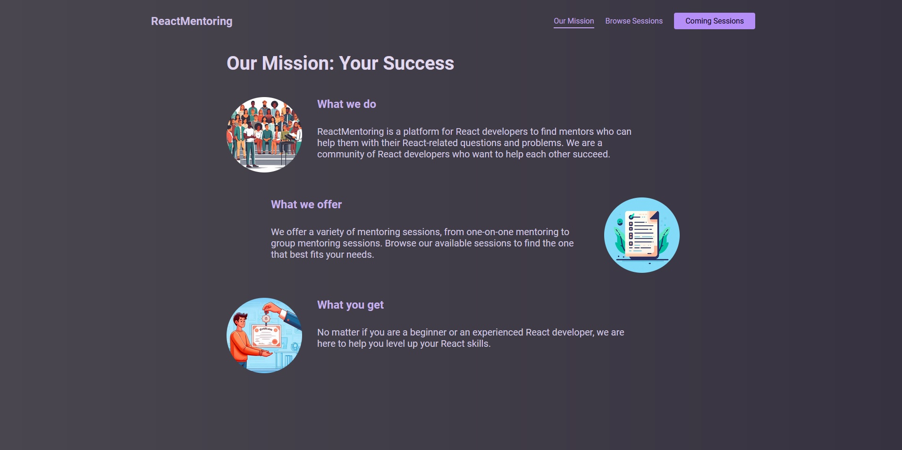
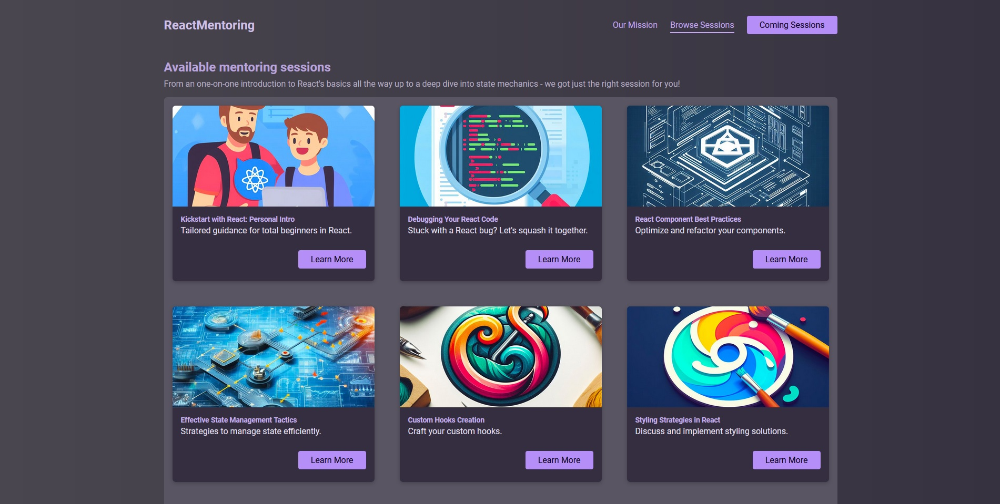

# React mentoring

Projeto prático de finalização do curso de React & TypeScript - The Practical Guide.




Confira o deploy do projeto: https://react-mentoring.vercel.app/sessions

## Funcionalidades

- Listar sessões
- Mostrar sessão específica
- Agendar sessão 
- Mostrar sessões agendadas
- Cancelar sessões agendadas

## Instalação

Instale react-mentoring com npm

```bash
  git clone https://github.com/DevMateusmac/react-mentoring
  
  cd react-mentoring
  
  npm install

  npm run dev
```